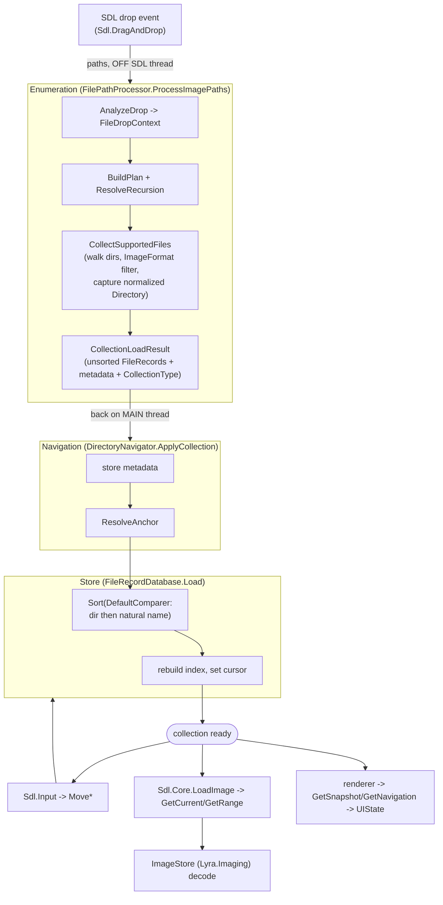
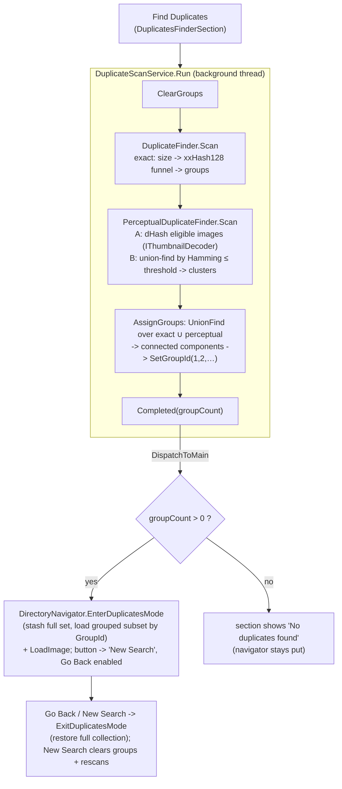

# FileLoader

Everything between "the user dropped some paths" and "the viewer has an ordered,
navigable collection of images" - plus duplicate detection over that collection.
Each folder is its own sub-namespace (`Lyra.FileLoader.Enumeration`, `.Store`,
`.Navigation`, `.Duplicates`, and the nested `.Duplicates.Exact` / `.Duplicates.Perceptual`);
the orchestrator services reach across them via `using`.

```
FileLoader/
├── Enumeration/   Disk scan + drop analysis -> an unsorted set of FileRecords + metadata
│   ├── FileDropContext.cs       What was dropped (explicit files/dirs, anchor, flags)
│   ├── FileLoaderRecursion.cs   Recursion policy (AsDesigned / Always / Never)
│   ├── FilePathProcessor.cs     The scanner: analyse -> plan -> enumerate -> classify
│   ├── CollectionType.cs        Classification of the drop (single dir, multi-dir, …)
│   └── CollectionLoadResult.cs  The handoff DTO out of the scanner
│
├── Store/         The in-memory "database": ordered records + a cursor + a duplicates view.
│   ├── FileRecord.cs            readonly record struct (Path, Name, Directory, Size,
│   │                            PHash, ContentHash, GroupId); all-but-identity are lazy
│   └── FileRecordDatabase.cs    static store: Load/Sort, cursor (Move*), lazy Set*,
│                                GetRange, group ids, duplicates-view stash/restore
│
├── Navigation/    Directory-aware view over the Store, for input + UI.
│   ├── DirectoryNavigator.cs    Cursor delegation, dir-edge nav, per-dir counter, tree,
│   │                            snapshot, and duplicates-mode enter/exit
│   ├── DirEntry.cs              One node of the directory tree (Path, HasImages)
│   └── DirectorySnapshot.cs     Immutable per-frame snapshot for the UI
│
└── Duplicates/    On-demand duplicate detection over the Store.
    ├── DuplicateScanService.cs           Orchestrates a scan off-thread, merges results, assigns GroupIds
    ├── UnionFind.cs                      Disjoint-set used to merge exact ∪ perceptual into clusters
    ├── Exact/                            size -> content-hash duplicates
    │   ├── DuplicateFinder.cs            the funnel: size collide -> xxHash128 -> groups
    │   ├── DuplicateGroup.cs             a set of byte-identical files (Size, ContentHash, Files)
    │   └── DuplicateScanProgress.cs      progress DTO (sized / hashed / candidates)
    └── Perceptual/                       visual-similarity duplicates
        ├── PerceptualDuplicateFinder.cs  hash eligible images, cluster by Hamming distance
        ├── PerceptualGroup.cs            a cluster of visually-similar files
        ├── PerceptualScanProgress.cs     progress DTO (hashed / total)
        ├── PerceptualHash.cs             dHash (9×8 -> 64 bits) + Hamming Distance
        ├── IThumbnailSource.cs           seam for pulling a small luma buffer (DI for tests)
        └── ImagingThumbnailSource.cs     adapter over Lyra.Imaging.GrayscaleThumbnail
```

The decode side of perceptual hashing lives in **Lyra.Imaging** (Core depends on Imaging,
never the reverse): `GrayscaleThumbnail.Decode` + the optional `IThumbnailDecoder` capability
that decoders (Skia, SVG so far) implement to produce a small image cheaply. Only a `byte[]`
luma buffer crosses the assembly boundary.

## Layering (who depends on whom)

```
Enumeration ─┐
             ├─► Store ◄── Navigation ◄── (UI / SdlCore)
             │      ▲           ▲
   (produces records)     Duplicates ──► Lyra.Imaging (decode -> luma)
```

The **Store** is the hub and knows nothing about disk, directories, or decoding.
**Enumeration** fills it, **Navigation** presents it, **Duplicates** scans it (decoding via
Imaging) and writes GroupIds back into it.

## End-to-end flow: drag & drop -> displayed image



## Duplicate scanning

Triggered from the **Duplicates Finder** sidebar section (revealed by the MENU ->
"DUPLICATES FINDER" button). The scan runs off the SDL thread via `DuplicateScanService`
and reports progress to the status overlay; on completion the result is applied on the
main thread.



Exact and perceptual results are **merged into one grouping**: a file that is a byte-identical
duplicate of A *and* perceptually similar to B lands in a single group (union-find over both
relations). Exact duplicates are therefore a subset of the clusters they sit in.

## DuplicatesMode (the Store's view swap)

Rather than filtering on every cursor read, entering duplicates mode **stashes** the full
collection and loads only the grouped records (sorted by GroupId) as the active list:

```
EnterDuplicatesView()  -> stash _records + cursor; _records = grouped subset (by GroupId); cursor = 0
ExitDuplicatesView()   -> restore the stash
```

All existing cursor/range/counter logic then works unchanged on a list that already contains
only what should be shown. `DirectoryNavigator.EnterDuplicatesMode/ExitDuplicatesMode` wrap
this and bump the version so the directory tree/snapshot refresh.

## Key invariants

- **Ordering lives in the Store, not the scanner.** `FilePathProcessor` returns an *unsorted*
  set; `FileRecordDatabase.Load` applies `DirectoryNavigator.DefaultComparer` (group by
  `Directory`, then natural-sort by `Name`). Directory grouping keeps dir-edge nav and the
  per-directory counter correct.
- **`FileRecord.Directory` is captured once, at enumeration time**, using the same
  normalization that builds `AllDirectories` - so directory-tree `HasImages` matches by
  construction; nothing recomputes a file's directory during navigation.
- **`Size` / `PHash` / `ContentHash` / `GroupId` are lazy** (`0` / `null` = not computed).
  Sizes and content hashes are filled only on the size-colliding candidates; perceptual
  hashes only on `IThumbnailDecoder`-eligible images. A scan never touches the whole
  collection's bytes unnecessarily.
- **Perceptual sentinel safety.** `PerceptualHash` reserves a top "computed" marker bit, so a
  flat image's all-zero dHash is never mistaken for "not computed"; the marker is constant
  across hashes, so it does not affect `Distance`.
- **Exact eligibility is universal; perceptual is gated.** Content hashing is format-agnostic
  (PSD/PSB included). Perceptual hashing is skipped for `[NoPerceptualHash]` formats (PSD/PSB)
  and for any format whose decoder lacks `IThumbnailDecoder` (those keep `PHash = 0`).
- **Nothing is ever deleted or modified on disk** by this subsystem. Duplicates are surfaced as
  data and as a navigable, restorable view.
