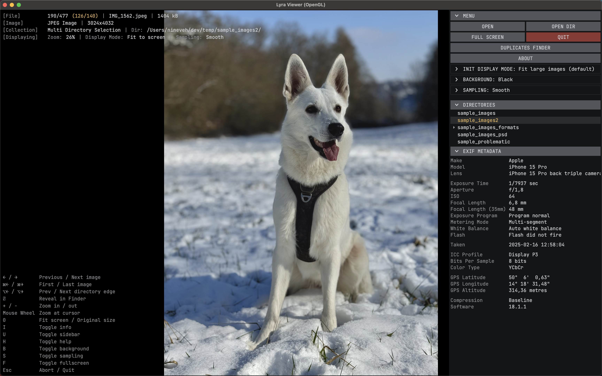
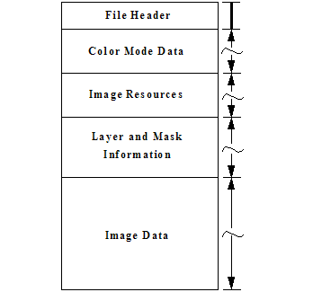
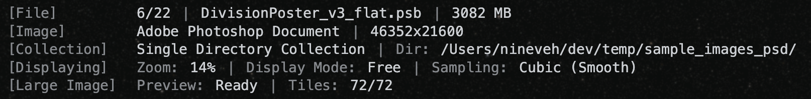
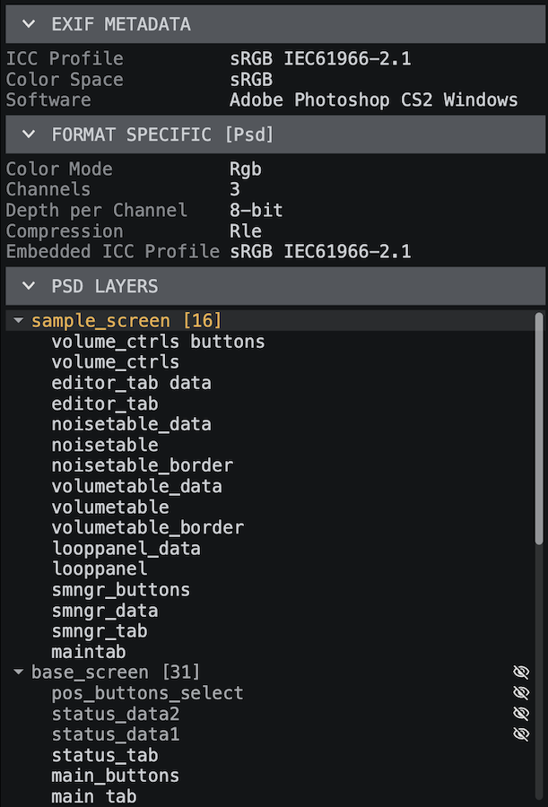

# Lyra Viewer

[](https://ko-fi.com/nineveh_dev)

---

## Contents

- [Overview](#overview)
    - [What Lyra is and what it isn't](#what-lyra-is-and-what-it-isnt)
    - [Recommended hardware & known limitations](#recommended-hardware--known-limitations)
- [Key Features](#key-features)
- [Technical Details](#technical-details)
- [Supported Image Formats](#supported-image-formats)
    - [Common Raster Formats (Essential)](#common-raster-formats-essential)
    - [Modern / Web-Friendly Formats](#modern--web-friendly-formats)
    - [High Dynamic Range Formats](#high-dynamic-range-formats)
    - [GPU Formats](#gpu-formats)
    - [Document / Vector Formats](#document--vector-formats)
    - [Minor Formats](#minor-formats)
- [PSD / PSB Decoding Model](#psd--psb-decoding-model)
    - [PSD Color Mode Support](#psd-color-mode-support)
    - [PSB Support](#psb-support)
    - [ICC Color Profiles](#icc-color-profiles)
    - [Displayed PSD Information](#displayed-psd-information)
    - [Future Direction](#future-direction)
- [DDS Texture Decoding Model](#dds-texture-decoding-model)
    - [Supported DDS Formats](#supported-dds-formats)
    - [Color & Signedness](#color--signedness)
    - [File Inspector](#file-inspector)
    - [Safety](#safety)
    - [Not Yet Supported](#not-yet-supported)
- [Keyboard Shortcuts & Controls](#keyboard-shortcuts--controls)
    - [macOS Specific](#macos-specific)
    - [Open With / Drag & Drop](#open-with--drag--drop)
- [Dependencies](#dependencies)
- [Installation](#installation)
    - [macOS (Homebrew)](#macos-homebrew)
    - [Linux](#linux)
- [Configuration & Data Files (UNIX specific)](#configuration--data-files-unix-specific)
    - [Configuration](#configuration)
    - [Data](#data)

## Overview



Lyra is a high-performance, minimalist image viewer designed for speed, fluid navigation, and precision.
It handles modern and professional image formats without the overhead of full editing suites or Electron-based tools.
Built for anyone who relies on images as a core resource in their workflow:

- 2D/3D artists and game developers browsing texture maps and baked assets
- Photographers reviewing large batches of exports
- Developers inspecting UI assets, icons, and generated output
- And ordinary advanced users

### What Lyra is and what it isn't

- Lyra is solely a viewer - nothing more. It opens and displays your files; it never writes to them, moves them, or
  deletes them. Your files are always safe and untouched.
- Lyra is not an Electron application. It is a native application built on SDL3 and Skia, with no embedded web
  browser and no JavaScript runtime. It runs on .NET 9 and renders directly through your GPU, keeping performance at the
  forefront of every decision.
- Lyra does not connect to the internet. It has no telemetry, no update pings, no cloud sync, no nag screens, and no AI
  features. Everything runs locally, offline, on your machine. Updates are manual - check for new releases and install
  them through your package manager when you're ready. If there's a format, workflow, or feature you'd like to see, the 
  right place to say so is the [GitHub issue tracker](https://github.com/lyra-viewer/Lyra/issues).

### Recommended hardware & known limitations

Lyra is designed for capable, modern hardware - a dedicated GPU and SSD storage will get the best out of it. Not every
limitation is Lyra's to solve: network shares over SMB are constrained to a single stream by the protocol itself and
cannot be parallelised, so performance over a NAS or remote share will always be bounded by that ceiling.

---

## Key Features

- Fast navigation through large directories of images or texture assets.
- **Directory tree sidebar** for browsing the filesystem without leaving the viewer.
- **SVG** support for previewing scalable vector assets.
- **Adjustable background** modes to improve visibility of transparent images.
- **EXIF metadata** and format-specific information panel.
- **PSD layer hierarchy** panel showing group structure, layer names, and visibility state.
- Zoom-to-cursor and panning for intuitive inspection at any scale.
- Reasonable support for modern image formats, with limited support for older formats that refuse to die.

---

## Technical Details

Lyra is built on .NET 9 with SDL3 for windowing and input, and SkiaSharp for hardware-accelerated rendering via OpenGL or Metal.
It is not an Electron app - there is no embedded browser, no web runtime, and no hidden resource overhead (and definitely no AI client).
The architecture is designed around fast, non-blocking image loading:

- Decoded images are cached and adjacent files are preloaded in the background, so navigation feels instant even in large directories.
- Large PSD/PSB files use streaming and tiled decoding to avoid loading entire documents into memory - tested with files exceeding 3 GB.

[//]: # (TODO: Add ManagedReaders)

Lyra integrates lightweight native interop wrappers for EXR, JPEG 2000, and TIFF decoding, and delegates format-specific work to focused libraries 
rather than bundling large native dependencies. Simpler formats such as TGA are handled by a small in-house managed decoder with no external dependency. 
System libraries like libheif, OpenJPEG, OpenEXR and libtiff are expected from the package manager (e.g. Homebrew).
Originally built for workflows involving texture maps, HDRIs, and assets exported from tools like Blender and Quixel Bridge - but the design 
generalizes well to any image-heavy workflow.

> _Developer note:_ Lyra is designed and written simultaneously.
> As a result, parts of the code reflect iterative exploration rather than a fully pre-planned architecture.
> Refactoring is ongoing wherever it improves clarity or maintainability.

---

## Supported Image Formats

### Common Raster Formats (Essential)

| Format      | Description                                      | Extensions                    |
|-------------|--------------------------------------------------|-------------------------------|
| PNG         | Lossless raster image format with optional alpha | `.png`                        |
| JPEG / JFIF | Lossy raster image format (JPEG family)          | `.jpg` `.jpeg` `.jif` `.jfif` |
| TIFF        | High-precision raster image container            | `.tif` `.tiff`                |
| Targa       | Raster image format with optional alpha          | `.tga`                        |
| BMP         | Uncompressed bitmap image format                 | `.bmp`                        |

### Modern / Web-Friendly Formats

| Format      | Description                                         | Extensions      |
|-------------|-----------------------------------------------------|-----------------|
| AVIF        | High-efficiency image format based on AV1           | `.avif`         |
| HEIF / HEIC | High-efficiency image container format (HEVC-based) | `.heif` `.heic` |
| ~JPEG XL~   | ~JPEG XL Image Coding System~                       | ~`.jxl`~        |
| WebP        | Compressed raster image format with optional alpha  | `.webp`         |

### High Dynamic Range Formats

| Format       | Description                                     | Extensions |
|--------------|-------------------------------------------------|------------|
| OpenEXR      | High-dynamic range, multi-channel raster format | `.exr`     |
| Radiance HDR | High-dynamic range RGBE format                  | `.hdr`     |

> _Note:_ EXR and HDR images are tone-mapped for display using the **ACES filmic** curve, so high-dynamic-range
> highlights roll off smoothly instead of clipping harshly to white.

### GPU Formats

| Format | Description                    | Extensions       | Notes                                          |
|--------|--------------------------------|------------------|------------------------------------------------|
| DDS    | DirectDraw Surface             | `.dds`           | See *DDS Texture Decoding Model* section below |
| ~KTX~  | ~GPU texture container format~ | ~`.ktx` `.ktx2`~ |                                                |

### Document / Vector Formats

| Format    | Description              | Extensions    | Notes                                        |
|-----------|--------------------------|---------------|----------------------------------------------|
| SVG       | Scalable Vector Graphics | `.svg`        |                                              |
| Photoshop | Adobe Photoshop document | `.psd` `.psb` | See *PSD / PSB Decoding Model* section below |

### Minor Formats

| Format    | Description                   | Extensions                              | Notes                                                                                                                                                   |
|-----------|-------------------------------|-----------------------------------------|---------------------------------------------------------------------------------------------------------------------------------------------------------|
| ICO       | Icon container format         | `.ico`                                  |                                                                                                                                                         |
| ~ICNS~    | ~Apple icon container format~ | ~`.icns`~                               |                                                                                                                                                         |
| JPEG 2000 | Wavelet-based image format    | `.jp2` `.jpg2`<br/>`.j2k` `.j2c` `.jpc` | Lyra supports single-image JPEG 2000 files. Multi-image, animated, or compound JPEG 2000 formats (JPX, JPM, MJ2, JPIP) are intentionally NOT supported. |

> _Note:_ Crossed-out formats are not implemented yet.

---

## PSD / PSB Decoding Model

Lyra currently focuses on decoding the flattened **Image Data** section of Photoshop files, rather than individual
layers. This design choice prioritizes performance and fast previewing.

For PSD / PSB files, Lyra also surfaces the **layer hierarchy** in the sidebar - showing group structure, layer names,
and visibility state - independently of the flattened composite decode.

This is explicitly documented because the Image Data section is not strictly mandatory in the PSD specification and,
in some edge cases, may be missing or may not fully represent the document as it appears when opened in Photoshop.



[Adobe Photoshop File Format Specification](https://www.adobe.com/devnet-apps/photoshop/fileformatashtml/PhotoshopFileFormats.htm#50577409_pgfId-1036097)

### PSD Color Mode Support

| Color Mode                   | Channels    | Lyra Support             |
|------------------------------|-------------|--------------------------|
| Bitmap                       | 1 (1-bit)   | Planned                  |
| Grayscale                    | 1           | Full                     |
| Duotone / Tritone / Quadtone | 1 + inks    | In progress (clean-room) |
| Indexed                      | 1 + palette | Full                     |
| RGB                          | 3           | Full                     |
| CMYK                         | 4           | Full                     |
| Lab                          | 3           | MVP                      |
| Multichannel                 | N           | In progress (clean-room) |

> _Legal Note:_ Duotone and Multichannel support is an independent, clean-room implementation. It was derived by
> observing the documented PSD/PSB file structure, publicly available format references, and the contents of sample
> files - not by decompiling, disassembling, or otherwise reverse-engineering Adobe software, and not from any Adobe
> source code. Spot/named colors are rendered using the color values stored within each document; no proprietary color
> libraries (e.g. PANTONE) are bundled.

### PSB Support

Lyra fully supports PSB (Photoshop Big Document Format) files.

- Successfully tested with ~3 GB PSB files
- Uses streaming / tiled decoding internally where possible to avoid loading entire images eagerly



### ICC Color Profiles

Lyra honors embedded ICC color profiles whenever they are present.
If a PSD / PSB document does not contain an embedded profile - most notably in CMYK color modes - Lyra falls back to
the system’s default color profile to produce a usable result.

Without an explicit ICC profile, CMYK data has no well-defined color meaning.
In such cases, different viewers may interpret the same document very differently, sometimes resulting in
severely distorted or inverted-looking colors.

Lyra’s fallback behavior is intended to be predictable and standards-compliant rather than attempting
heuristic or hard-coded CMYK assumptions.

> _Developer note:_ During development, Lyra was tested against several large CMYK PSB files from the NASA public image
> archive.
> These documents did not contain embedded ICC profiles and produced drastically different results across common
> image viewers - ranging from heavily shifted colors to near-inverted appearances.
>
> This behavior is not a defect of the files themselves, but a direct consequence of CMYK data being interpreted
> without a defined color profile.

### Displayed PSD Information

When viewing a PSD or PSB file, Lyra surfaces document-level metadata and the full layer hierarchy through dedicated
sidebar sections. This information is extracted directly from the binary file structure during decoding.

**PSD Layers**

The **PSD Layers** section presents the full layer hierarchy as a tree view, reconstructed from the flat layer record
list stored in the file. Groups are displayed with their child count and can be expanded or collapsed.

This display is read-only and independent of the flattened composite decode - Lyra does not render individual
layer contents, but provides the structural overview that is otherwise only visible inside Photoshop.



### Future Direction

The PSD decoder is intentionally structured to allow future expansion.

---

## DDS Texture Decoding Model

DDS is a GPU texture container - one file can hold a full mip chain, cube-map faces, array layers, or
volume slices, usually in a block-compressed GPU format. Lyra reads it with a **pure-managed** codec (no
native dependencies): for display it decodes the base surface (mip 0, first face / layer); for thumbnails and
perceptual hashing it decodes the *smallest stored mip that still covers the target size*.

Both the legacy `DDS_PIXELFORMAT` header and the `DX10` extended header are handled, including four-character
codes (`DXT1`, `ATI2`, `BC5S`, …), the numeric `D3DFORMAT` codes some older D3D9 exporters store in the FourCC
field, and `DXGI_FORMAT` identifiers.

### Supported DDS Formats

| Family                 | Formats                                            | Notes                              |
|------------------------|----------------------------------------------------|------------------------------------|
| Block-compressed (BCn) | BC1–BC3 (DXT1/3/5), BC4 / BC5 (unorm + snorm), BC7 | The mainstream desktop formats     |
| HDR block              | BC6H (signed + unsigned)                           | Decoded to float, then tone-mapped |
| Uncompressed 8-bit     | RGBA8, BGRA8 (+ sRGB), RGBA8 `snorm`               | `snorm` is remapped for display    |
| Uncompressed float     | RGBA16F, RGBA32F                                   | Decoded to float, then tone-mapped |

The decoders are validated **bit-for-bit** against independent reference decoders - BC1 / BC3 / BC7 against
Pillow and BC6H against `imagecodecs` - across fuzzed inputs covering every block mode and partition.

### Color & Signedness

Decoding is **faithful** - no color transform is applied, so an sRGB source decodes to sRGB-tagged bytes and the
display path linearizes.

- **HDR formats** (BC6H, RGBA16F / RGBA32F) are scene-referred float and are tone-mapped with the same
  **ACES filmic** curve used for EXR and Radiance HDR, so highlights roll off smoothly instead of clipping.
- **Signed (`snorm`) formats** - common in bump / normal maps - are remapped from `[-1, 1]` to `[0, 1]`, which
  avoids the "shifted color" look some viewers produce by rendering the raw signed bytes as unsigned.

### File Inspector

When a DDS is open, two sidebar sections surface its internals:

- **Format Specific** lists the headline facts: the source-native format name (e.g. `BC7_UNORM`, `DXT4`, or
  `R16G16B16A16_FLOAT (FourCC 'q')` when a numeric `D3DFORMAT` is decoded), *Has Alpha*, *Is Cubemap*,
  *Is Volume*, *Depth* (volumes only), *Mipmap Count*, and *Bits/Pixel*.
- **Structure** is a scrollable, collapsible view of the file's binary layout - the DDS header, pixel-format
  and capabilities sub-structures, and every mip level. Each part shows its name, a short description and its
  byte size, and expands to the raw key-value fields it holds.

### Safety

Lyra treats DDS input as hostile. It parses the full subresource layout (mips, faces, array layers, volume
depth slices) and **validates every subresource's byte range against the file length** before exposing it;
dimensions, mip counts and surface sizes are bounds-checked against overflow. A malformed or truncated header
is rejected cleanly rather than read out of bounds, and an unrecognized format fails with a descriptive message
naming the exact `DXGI_FORMAT` or FourCC rather than failing silently.

### Not Yet Supported

- **ASTC** (e.g. `DXGI_FORMAT_ASTC_6X6_UNORM`) - reported with a clear, named error rather than decoded.
- **ETC2 / EAC** - rarely seen inside DDS.
- **KTX / KTX2** containers (`.ktx`, `.ktx2`) reuse the same block decoders and are planned.

---

## Keyboard Shortcuts & Controls

| Key                   | Action                                            |
|-----------------------|---------------------------------------------------|
| `←` `→`               | Previous / Next image                             |
| `Home` `End`          | First / Last image                                |
| `+` `-`               | Zoom in / Zoom out                                |
| `Mouse Wheel`         | Zoom at cursor position                           |
| `Middle Mouse Button` | Customizable (see `app-settings.toml`)            |
| `0`                   | Toggle **Fit to Screen** / **Original Size**      |
| `S`                   | Toggle sampling mode                              |
| `F`                   | Toggle fullscreen                                 |
| `B`                   | Toggle background mode                            |
| `I`                   | Toggle image information overlay                  |
| `H`                   | Toggle help bar                                   |
| `Return`              | Reveal image or directory in native file explorer |
| `Esc`                 | Exit application                                  |

### macOS Specific

| Key         | Action                                  |
|-------------|-----------------------------------------|
| `⌘ ←` `⌘ →` | First / Last image                      |
| `⌥ ←` `⌥ →` | First / Last image within the directory |

### Open With / Drag & Drop

| Context                                | How Lyra interprets it                   | Make a collection from files around | Recursion |
|----------------------------------------|------------------------------------------|-------------------------------------|-----------|
| Single file                            | Anchor (Open / Open With / Double-click) | Yes                                 | No        |
| Multiple files (same directory)        | Selection                                | No                                  | No        |
| Single directory                       | Directory collection                     | No                                  | Yes       |
| Multiple directories                   | Multi-directory selection                | No                                  | Yes       |
| Mixed files from different directories | Multi-directory selection                | No                                  | No        |

> Recursion applies only when directories are explicitly dropped.
> Opening or dropping files never implicitly expands into subdirectories.

> _Developer note:_ Lyra intentionally favors context-aware navigation.
> Opening a single image always implies “show me this image in relation to its neighbors”, not isolation.

---

## Dependencies

| Library           | Purpose                                                                | License       | Repository                                                        |
|-------------------|------------------------------------------------------------------------|---------------|-------------------------------------------------------------------|
| SDL3-CS           | Core graphics, input, and windowing                                    | zlib          | [github](https://github.com/edwardgushchin/SDL3-CS)               |
| SkiaSharp         | Hardware-accelerated 2D rendering                                      | BSD-3-Clause  | [github](https://github.com/mono/SkiaSharp)                       |
| Svg.Skia          | SVG parsing and rendering                                              | MIT           | [github](https://github.com/wieslawsoltes/Svg.Skia)               |
| LibHeifSharp      | HEIF / HEIC image decoding                                             | LGPL-3.0      | [github](https://github.com/0xC0000054/libheif-sharp)             |
| OpenEXR           | High-dynamic-range OpenEXR (.exr) decoding                             | BSD-3-Clause  | [github](https://github.com/AcademySoftwareFoundation/openexr)    |
| OpenJPEG          | JPEG 2000 still-image decoding                                         | BSD-2-Clause  | [github](https://github.com/uclouvain/openjpeg)                   |
| libtiff           | TIFF decoding                                                          | BSD-like      | [gitlab](https://gitlab.com/libtiff/libtiff)                      |
| Unicolour         | Color space conversions & perceptual color math (used in PSD decoding) | MIT           | [github](https://github.com/waacton/Unicolour)                    |
| MetadataExtractor | EXIF metadata extraction                                               | Apache 2.0    | [github](https://github.com/drewnoakes/metadata-extractor-dotnet) |

---

## Installation

Lyra Viewer is distributed via **Homebrew** on macOS.

### macOS (Homebrew)

```sh
brew tap lyra-viewer/lyra
brew install --cask lyra-viewer
```

### Linux

Not available yet.

---

## Configuration & Data Files (UNIX specific)

Lyra stores configuration and runtime data in standard XDG-compliant locations.

### Configuration

```~/.config/lyra-viewer/```

| File                | Description                                                                               |
|---------------------|-------------------------------------------------------------------------------------------|
| `app-settings.toml` | Application settings: renderer, window state, middle mouse button function, text sizes... |
| `ui-settings.toml`  | UI state - saved automatically on exit                                                    |

### Data

```~/.local/share/lyra-viewer/```

| File                  | Description                                                            |
|-----------------------|------------------------------------------------------------------------|
| `log.txt`             | Application log output                                                 |
| `load-time-data.toml` | Recorded decode times per format, used to estimate loading progress    |

If any configuration file is missing or malformed, Lyra falls back to built-in defaults and recreates the file on next save.
Deleting everything under these directories is always safe - Lyra will start fresh with default settings.

---