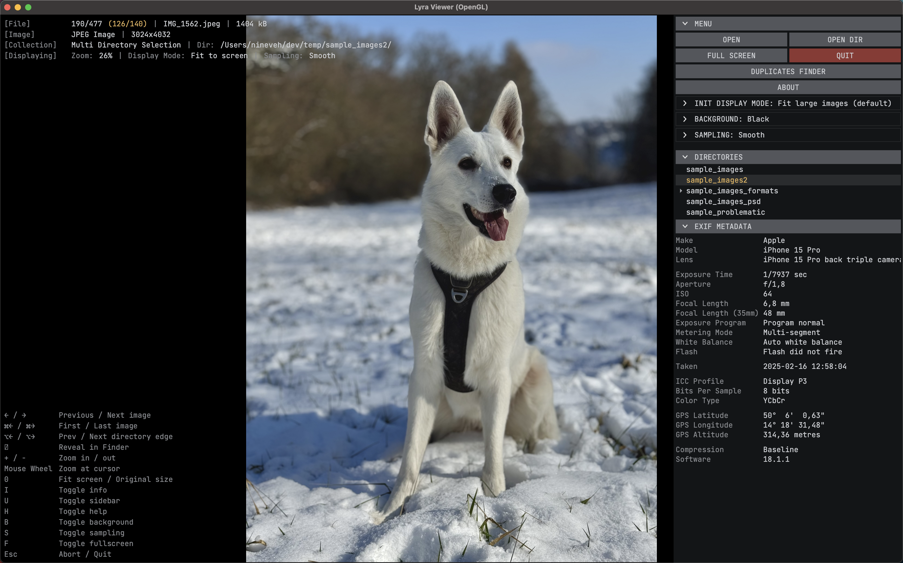

# Lyra Viewer

[](https://ko-fi.com/nineveh_dev)

---

## Contents

- [Overview](#overview)
    - [What Lyra is and what it isn't](#what-lyra-is-and-what-it-isnt)
    - [Recommended hardware & known limitations](#recommended-hardware--known-limitations)
- [Key Features](#key-features)
- [Technical Details](#technical-details)
    - [Technical Documentation](docs/technical.md) - decoding, color, HDR, PSD and texture internals
- [Supported Image Formats](#supported-image-formats)
    - [Common Raster Formats (Essential)](#common-raster-formats-essential)
    - [Modern / Web-Friendly Formats](#modern--web-friendly-formats)
    - [High Dynamic Range Formats](#high-dynamic-range-formats)
    - [GPU Formats](#gpu-formats)
    - [Document / Vector Formats](#document--vector-formats)
    - [Minor Formats](#minor-formats)
- [Keyboard Shortcuts & Controls](#keyboard-shortcuts--controls)
    - [macOS Specific](#macos-specific)
    - [Open With / Drag & Drop](#open-with--drag--drop)
- [Dependencies](#dependencies)
- [Native Libraries & Bundling](#native-libraries--bundling)
- [Installation](#installation)
    - [macOS (Homebrew)](#macos-homebrew)
    - [Windows (Scoop)](#windows-scoop)
    - [Linux (APT)](#linux-apt)
    - [Linux (direct .deb)](#linux-direct-deb)
    - [Linux (Flatpak)](#linux-flatpak)
- [Configuration & Data Files](#configuration--data-files)
    - [Configuration](#configuration)
    - [Data](#data)
    - [Cache](#cache)

## Overview



Lyra is a high-performance, minimalist image viewer designed for speed, fluid navigation, and precision.
It handles modern and professional image formats without the overhead of full editing suites or Electron-based tools.
Built for anyone who relies on images as a core resource in their workflow:

- 2D/3D artists and game developers browsing texture maps and baked assets
- Photographers reviewing large batches of exports
- Developers inspecting UI assets, icons, and generated output
- And ordinary advanced users

### What Lyra is and what it isn't

- Lyra is solely a viewer - nothing more. It opens and displays your files; it never writes to them, moves them, or
  deletes them. Your files are always safe and untouched.
- Lyra is not an Electron application. It is a native application built on SDL3 and Skia, with no embedded web
  browser and no JavaScript runtime. It runs on .NET 9 and renders directly through your GPU, keeping performance at the
  forefront of every decision.
- Lyra does not connect to the internet. It has no telemetry, no update pings, no cloud sync, no nag screens, and no AI
  features. Everything runs locally, offline, on your machine. Updates are manual - check for new releases and install
  them through your package manager (Homebrew, APT, Flatpak, or Scoop) when you're ready. If there's a format, workflow,
  or feature you'd like to see, the right place to say so is the [GitHub issue tracker](https://github.com/lyra-viewer/Lyra/issues).

### Recommended hardware & known limitations

Lyra is designed for capable, modern hardware - a dedicated GPU and SSD storage will get the best out of it. Not every
limitation is Lyra's to solve: network shares over SMB are constrained to a single stream by the protocol itself and
cannot be parallelised, so performance over a NAS or remote share will always be bounded by that ceiling.

---

## Key Features

- Fast, robust, minimalist, intuitive
- Native, not Electron - runs on macOS, Windows and Linux from one codebase
- Non-blocking loading - the UI never freezes on a decode; images arrive progressively while neighbors preload
- Runs offline, no telemetry, no update pings, no cloud, no AI features, no nag screens
- Read-only by design - never writes, moves or deletes a file
- Keyboard-driven, with the full key map on screen at a keystroke
- Duplicates finder - exact and visually similar, by perceptual hashing
- Directory tree sidebar 

<!-- Splits the list in two; -->

- Full graphics pipeline (Photoshop, textures, HDR maps)
- Adjustable background, sampling options
- Color-managed from decode to screen (embedded ICC, NCLX primaries)
- P3 wide-gamut support
- HDR kept scene-referred and tone-mapped as it is drawn - ACES filmic, extended Reinhard or clip, with exposure in stops
- EDR output on macOS - highlights drawn above SDR white on a display with headroom
- PSD / PSB streaming and tiled decoding
- TIFF in depth - BigTIFF, multi-page documents, 1 to 64-bit samples, signed, unsigned or float
- EXIF metadata
- PSD layer hierarchy
- File structure inspector (PSD / PSB, TIFF, DDS / KTX / KTX2)
- Variant picker for files carrying several renditions - the sizes inside an `.icns` / `.ico`, the pages of a TIFF

---

## Technical Details

Lyra is built on .NET 9 with SDL3 for windowing and input, and SkiaSharp for hardware-accelerated rendering via OpenGL
or Metal. It is not an Electron app - there is no embedded browser, no web runtime, and no hidden resource overhead
(and definitely no AI client). Decoding is split between **Lyra.ManagedCodecs**, a pure-managed codec library, and
lightweight native interop wrappers for EXR, JPEG 2000, JPEG XL and TIFF.

**See [Technical Documentation](docs/technical.md)** for the full detail:

- [Technical Details](docs/technical.md#technical-details) - architecture, caching, streaming and tiled decoding
- [Color Management](docs/technical.md#color-management) - decode / display / draw, and rendering intent
- [HDR / EDR](docs/technical.md#hdr--edr) - scene-referred light, tone mapping curves, EDR output
- [PSD / PSB Decoding Model](docs/technical.md#psd--psb-decoding-model) - color modes, PSB, ICC, layer hierarchy
- [DDS & KTX Texture Decoding Model](docs/technical.md#dds--ktx-texture-decoding-model) - formats, containers, inspector

---

## Supported Image Formats

### Common Raster Formats (Essential)

| Format      | Description                                      | Extensions                    | Notes                                                         |
|-------------|--------------------------------------------------|-------------------------------|---------------------------------------------------------------|
| PNG         | Lossless raster image format with optional alpha | `.png`                        |                                                               |
| JPEG / JFIF | Lossy raster image format (JPEG family)          | `.jpg` `.jpeg` `.jif` `.jfif` |                                                               |
| TIFF        | High-precision raster image container            | `.tif` `.tiff`                | See [Technical Details](docs/technical.md#technical-details). |
| Targa       | Raster image format with optional alpha          | `.tga`                        |                                                               |
| BMP         | Uncompressed bitmap image format                 | `.bmp`                        |                                                               |

### Modern / Web-Friendly Formats

| Format      | Description                                         | Extensions      | Notes                                                                                                                                                                                |
|-------------|-----------------------------------------------------|-----------------|--------------------------------------------------------------------------------------------------------------------------------------------------------------------------------------|
| AVIF        | High-efficiency image format based on AV1           | `.avif`         |                                                                                                                                                                                      |
| HEIF / HEIC | High-efficiency image container format (HEVC-based) | `.heif` `.heic` |                                                                                                                                                                                      |
| JPEG XL     | JPEG XL Image Coding System                         | `.jxl`          | Lyra displays static JPEG XL images. Animated JXL is decoded to its first frame only (same policy as JPEG 2000). HDR (floating-point) JXL gets the full [HDR / EDR](docs/technical.md#hdr--edr) path. |
| WebP        | Compressed raster image format with optional alpha  | `.webp`         |                                                                                                                                                                                      |

### Document / Vector Formats

| Format    | Description              | Extensions    | Notes                                        |
|-----------|--------------------------|---------------|----------------------------------------------|
| SVG       | Scalable Vector Graphics | `.svg`        |                                              |
| Photoshop | Adobe Photoshop document | `.psd` `.psb` | See [PSD / PSB Decoding Model](docs/technical.md#psd--psb-decoding-model) |

### High Dynamic Range Formats

| Format       | Description                                     | Extensions | Notes                                        |
|--------------|-------------------------------------------------|------------|----------------------------------------------|
| OpenEXR      | High-dynamic range, multi-channel raster format | `.exr`     |                                              |
| Radiance HDR | High-dynamic range RGBE format                  | `.hdr`     | See [HDR / EDR](docs/technical.md#hdr--edr). |

### GPU Formats

| Format | Description                   | Extensions     | Notes                                                |
|--------|-------------------------------|----------------|------------------------------------------------------|
| DDS    | DirectDraw Surface            | `.dds`         | See [DDS & KTX Texture Decoding Model](docs/technical.md#dds--ktx-texture-decoding-model) |
| KTX    | Khronos GPU texture container | `.ktx` `.ktx2` | KTX 1.x and KTX 2.0; see [the texture decoding model](docs/technical.md#dds--ktx-texture-decoding-model)               |

### Minor Formats

| Format    | Description                 | Extensions                              | Notes                                                                                                                                                                 |
|-----------|-----------------------------|-----------------------------------------|-----------------------------------------------------------------------------------------------------------------------------------------------------------------------|
| ICO       | Icon container format       | `.ico`                                  | Every entry in the container is decoded and selectable from the sidebar's **VARIANTS** section. Reads PNG and BMP (DIB) entries with their masks.                  |
| ICNS      | Apple icon container format | `.icns`                                 | Every size in the container is decoded and selectable from the sidebar's **VARIANTS** section. Reads PNG, JPEG 2000, ARGB and the legacy RLE24 plates with their masks. |
| JPEG 2000 | Wavelet-based image format  | `.jp2` `.jpg2`<br/>`.j2k` `.j2c` `.jpc` | Lyra supports single-image JPEG 2000 files. Multi-image, animated, or compound JPEG 2000 formats (JPX, JPM, MJ2, JPIP) are intentionally NOT supported.               |

---
## Keyboard Shortcuts & Controls

| Key                   | Action                                            |
|-----------------------|---------------------------------------------------|
| `←` `→`               | Previous / Next image                             |
| `Home` `End`          | First / Last image                                |
| `+` `-`               | Zoom in / Zoom out                                |
| `Mouse Wheel`         | Zoom at cursor position                           |
| `Middle Mouse Button` | Customizable (see `app-settings.toml`)            |
| `0`                   | Toggle **Fit to Screen** / **Original Size**      |
| `S`                   | Toggle sampling mode                              |
| `F`                   | Toggle fullscreen                                 |
| `B`                   | Toggle background mode                            |
| `I`                   | Toggle image information overlay                  |
| `H`                   | Toggle help overlay                               |
| `U`                   | Toggle sidebar                                    |
| `Return`              | Reveal image or directory in native file explorer |
| `Esc`                 | Cancel an operation, or exit application          |

### macOS Specific

| Key         | Action                                  |
|-------------|-----------------------------------------|
| `⌘ ←` `⌘ →` | First / Last image                      |
| `⌥ ←` `⌥ →` | First / Last image within the directory |

### Windows / Linux Specific

| Key               | Action                                  |
|-------------------|-----------------------------------------|
| `Ctrl ←` `Ctrl →` | First / Last image within the directory |

### Open With / Drag & Drop

| Context                                | How Lyra interprets it                   | Make a collection from files around | Recursion |
|----------------------------------------|------------------------------------------|-------------------------------------|-----------|
| Single file                            | Anchor (Open / Open With / Double-click) | Yes                                 | No        |
| Multiple files (same directory)        | Selection                                | No                                  | No        |
| Single directory                       | Directory collection                     | No                                  | Yes       |
| Multiple directories                   | Multi-directory selection                | No                                  | Yes       |
| Mixed files from different directories | Multi-directory selection                | No                                  | No        |

> Recursion applies only when directories are explicitly dropped.
> Opening or dropping files never implicitly expands into subdirectories.

> _Developer note:_ Lyra intentionally favors context-aware navigation.
> Opening a single image always implies “show me this image in relation to its neighbors”, not isolation.

---

## Dependencies

| Library           | Purpose                                                                                    | License      | Repository                                                        |
|-------------------|--------------------------------------------------------------------------------------------|--------------|-------------------------------------------------------------------|
| SDL3-CS           | Core graphics, input, and windowing                                                        | zlib         | [github](https://github.com/edwardgushchin/SDL3-CS)               |
| SkiaSharp         | Hardware-accelerated 2D rendering                                                          | BSD-3-Clause | [github](https://github.com/mono/SkiaSharp)                       |
| Svg.Skia          | SVG parsing and rendering                                                                  | MIT          | [github](https://github.com/wieslawsoltes/Svg.Skia)               |
| LibHeifSharp      | HEIF / HEIC image decoding                                                                 | LGPL-3.0     | [github](https://github.com/0xC0000054/libheif-sharp)             |
| OpenEXR           | High-dynamic-range OpenEXR (.exr) decoding                                                 | BSD-3-Clause | [github](https://github.com/AcademySoftwareFoundation/openexr)    |
| OpenJPEG          | JPEG 2000 still-image decoding                                                             | BSD-2-Clause | [github](https://github.com/uclouvain/openjpeg)                   |
| libjxl            | JPEG XL decoding (native wrapper)                                                          | BSD-3-Clause | [github](https://github.com/libjxl/libjxl)                        |
| libtiff           | TIFF decoding                                                                              | BSD-like     | [gitlab](https://gitlab.com/libtiff/libtiff)                      |
| Basis Universal   | KTX2 ETC1S / UASTC transcoding (native wrapper)                                            | Apache-2.0   | [github](https://github.com/BinomialLLC/basis_universal)          |
| ZstdSharp.Port    | Zstandard decompression for KTX2 supercompression                                          | MIT          | [github](https://github.com/oleg-st/ZstdSharp)                    |
| Unicolour         | Color space conversions & perceptual color math (transitive, via the in-house PSD decoder) | MIT          | [github](https://github.com/waacton/Unicolour)                    |
| MetadataExtractor | EXIF metadata extraction                                                                   | Apache-2.0   | [github](https://github.com/drewnoakes/metadata-extractor-dotnet) |
| Tomlyn            | TOML parsing for configuration files                                                       | BSD-2-Clause | [github](https://github.com/xoofx/Tomlyn)                         |
| System.IO.Hashing | Fast non-cryptographic hashing (duplicate detection)                                       | MIT          | [github](https://github.com/dotnet/runtime)                       |

---

## Native Libraries & Bundling

A handful of formats are decoded through native libraries (libheif, OpenJPEG, libjxl, OpenEXR, libtiff, plus the Basis
Universal transcoder). How those libraries are delivered depends on the platform:

- **macOS** - expected from the package manager (Homebrew).
- **Linux** - resolved as APT dependencies of the `.deb`, except for **libjxl**, which is vendored inside the
  package for now. This is a temporary measure until JPEG XL support is more widely available across Ubuntu releases; it
  will be dropped in favor of the system package once that lands.
- **Linux (Flatpak)** - self-contained: the libraries come from the Freedesktop runtime or are built into the Flatpak,
  so nothing needs to be installed on the host.
- **Windows** - bundled with the application. The wrapper DLLs are self-contained and ship inside the distribution, so no
  separate installation is required.

---

## Installation

Lyra Viewer is distributed via **Homebrew** on macOS, an **APT repository** (or a
direct `.deb`) on Debian/Ubuntu, a **Flatpak** repository for any Linux distribution, and **Scoop** on Windows.

### macOS (Homebrew)

```sh
brew tap lyra-viewer/lyra
brew trust --cask lyra-viewer/lyra/lyra-viewer
brew install --cask lyra-viewer
```

### Windows (Scoop)

```sh
scoop bucket add lyra-viewer https://github.com/lyra-viewer/scoop-lyra
scoop install lyra-viewer
```

Updates then arrive through `scoop update lyra-viewer`.

### Linux (APT)

Add the signed repository once, then install and receive updates through `apt`:

```sh
# 1. Trust the repository signing key
sudo mkdir -p /etc/apt/keyrings
curl -fsSL https://lyra-viewer.github.io/apt-lyra/lyra-archive-keyring.asc \
  | sudo gpg --dearmor -o /etc/apt/keyrings/lyra.gpg

# 2. Add the repository
echo "deb [signed-by=/etc/apt/keyrings/lyra.gpg] https://lyra-viewer.github.io/apt-lyra stable main" \
  | sudo tee /etc/apt/sources.list.d/lyra.list

# 3. Install
sudo apt update
sudo apt install lyra-viewer
```

Updates then arrive through the usual `sudo apt update && sudo apt upgrade`.

To remove the repository:

```sh
sudo rm /etc/apt/sources.list.d/lyra.list /etc/apt/keyrings/lyra.gpg
sudo apt update
```

### Linux (direct .deb)

Prefer not to add a repository? Download `lyra-viewer_<version>_amd64.deb` from the
[latest release](https://github.com/lyra-viewer/Lyra/releases/latest) and install it
directly (`apt` resolves the system dependencies):

```sh
sudo apt install ./lyra-viewer_0.6.0_amd64.deb
```

### Linux (Flatpak)

Works on any distribution with Flatpak. One command adds the signed repository (and Flathub, for the runtime) and
installs Lyra:

```sh
flatpak install --user https://lyra-viewer.github.io/flatpak-lyra/lyra-viewer.flatpakref
```

Updates then arrive through `flatpak update`. A standalone `LyraViewer-linux-x86_64.flatpak` is also attached to each
[release](https://github.com/lyra-viewer/Lyra/releases/latest); installing it subscribes to the same repository for
updates:

```sh
flatpak install --user ./LyraViewer-linux-x86_64.flatpak
```

The Flatpak has read-only access to your files, so it can browse folders and find duplicates, but never modifies them.

To uninstall:

```sh
flatpak uninstall --user com.nineveh.LyraViewer
flatpak remote-delete --user lyra   # if you installed the bundle, `flatpak remotes` shows its remote's name
```

> _Note:_ Linux builds (`.deb` and Flatpak) are **amd64 (x86-64)** only for now.

---

## Configuration & Data Files

Where Lyra keeps its files depends on how it was installed:

| Channel              | Configuration                                           | Data                                                  | Cache                                                  |
|----------------------|---------------------------------------------------------|-------------------------------------------------------|--------------------------------------------------------|
| macOS (Homebrew)     | `~/.config/lyra-viewer/`                                | `~/.local/share/lyra-viewer/`                         | `~/.cache/lyra-viewer/`                                |
| Linux (APT / `.deb`) | `~/.config/lyra-viewer/`                                | `~/.local/share/lyra-viewer/`                         | `~/.cache/lyra-viewer/`                                |
| Linux (Flatpak)      | `~/.var/app/com.nineveh.LyraViewer/config/lyra-viewer/` | `~/.var/app/com.nineveh.LyraViewer/data/lyra-viewer/` | `~/.var/app/com.nineveh.LyraViewer/cache/lyra-viewer/` |
| Windows (Scoop)      | `%LOCALAPPDATA%\lyra-viewer\`                           | `%LOCALAPPDATA%\lyra-viewer\`                         | `%LOCALAPPDATA%\lyra-viewer\cache\`                    |

On macOS and Linux these follow the XDG base directories, so `XDG_CONFIG_HOME`, `XDG_DATA_HOME` and `XDG_CACHE_HOME` are
honored when set. The Flatpak's files are separate from a `.deb` install's: switching between the two starts with default
settings, unless you copy the `lyra-viewer/` folders across.

### Configuration

| File                | Description                                                                               |
|---------------------|-------------------------------------------------------------------------------------------|
| `app-settings.toml` | Application settings: renderer, window state, middle mouse button function, text sizes... |
| `ui-settings.toml`  | UI state - saved automatically on exit                                                    |
| `themes/`           | Color themes, one `.toml` per theme, selected by `theme` in `app-settings.toml`           |

### Data

| File                  | Description                                                            |
|-----------------------|------------------------------------------------------------------------|
| `log.txt`             | Application log output                                                 |
| `log.previous.txt`    | Log of the previous run                                                |
| `load-time-data.toml` | Recorded decode times per format, used to estimate loading progress    |

### Cache

| Path       | Description                                                                                                                                  |
|------------|----------------------------------------------------------------------------------------------------------------------------------------------|
| `scratch/` | Temporary local copies of very large files read from slow or network storage. Can briefly hold multi-GB files; each is deleted after decoding, and leftovers from a crashed run are removed on next start. |

If any configuration file is missing or malformed, Lyra falls back to built-in defaults and recreates the file on next save.
Deleting everything under these folders is always safe - Lyra will start fresh with default settings.

---
